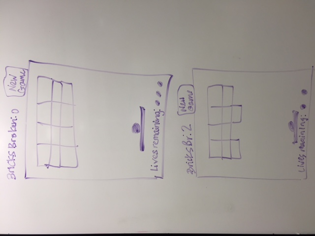

#Project 1 - Breakout!

####K. Taylor Britton
####WDI-SM-24

####Play Breakout! here:
https://hippoish.github.io/project1_brick_breaker/

#####Project Board on Trello
https://trello.com/b/ozOjZBRa/project1-breakout

######Description
In breakout, the user controls a paddle at the bottom of the board with the goal of bouncing a moving ball and making it hit bricks at the top of the board. When a brick is hit, it disappears and a point is scored. When all the bricks have been broken, the user advances to the next level, and when all the levels have been beaten, the user has won!

There are two ways to control the ball: with the mouse or with the keypad.
- If using the mouse, at the beginning of the game and on every new life, click anywhere on the board to launch the ball, then move the mouse left and right within the board to move the paddle.
- If using the keypad, press spacebar to launch the ball, and press the left and right arrow keys to move the paddle.

######Technologies
- HTML5
- JavaScript
- CSS
- jQuery

######Approach
I wanted to use canvas to make my game, so the first thing I did was learn how to make the canvas element in my html document and draw shapes on it with JavaScript. I then used MDN to learn how to write a function with directions for moving the shapes that used requestAnimationFrame() to redraw the canvas.

######Instructions for Installation/Startup
Clone the repository from github to your computer and open the index.html file in your browser.

######Unsolved Problems

######Next Steps/Future Features
- different points values on different bricks
- adjust difficulty by increasing speed of the ball
- special bricks that require more hits to break or that do special things like give extra lives, make extra simultaneous balls, or slow down the ball.
- take user input for board dimensions

######Wireframe

